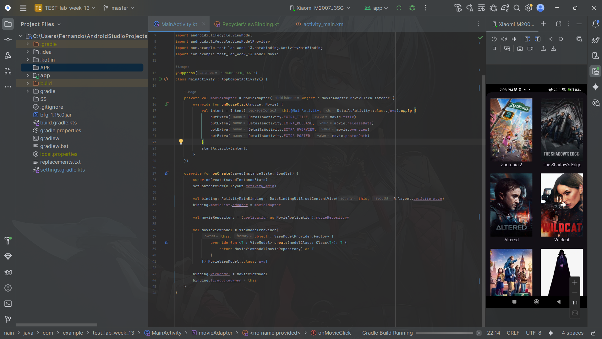
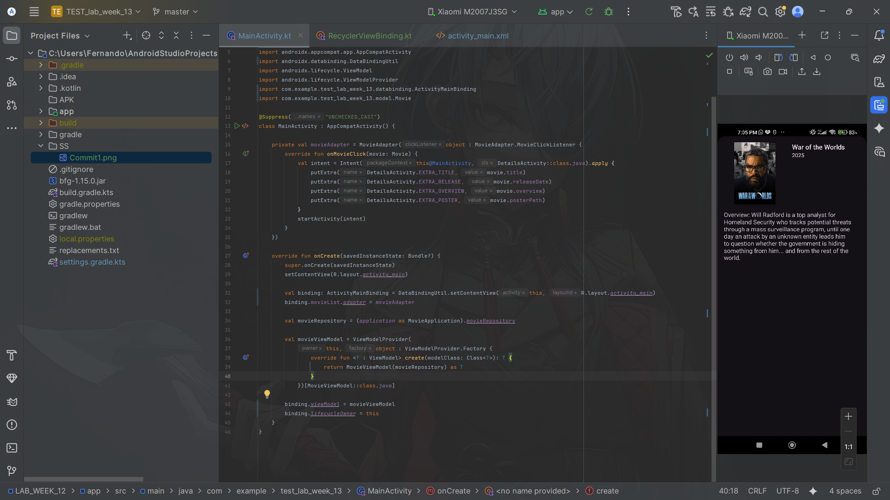
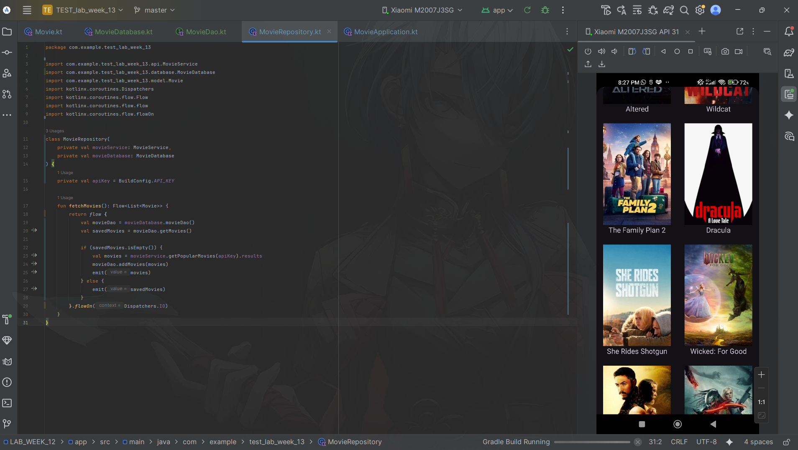
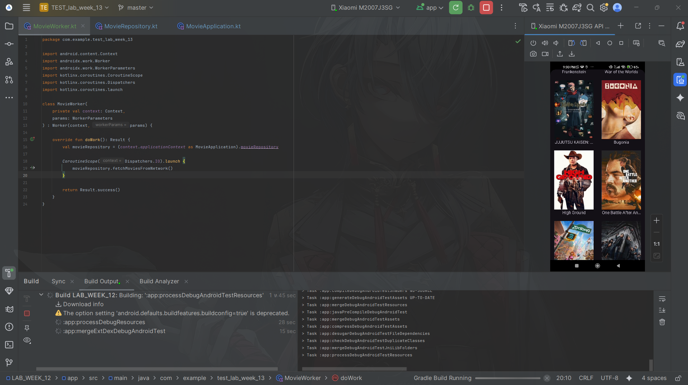

### Submitted by:
* **Nama:** Fernando Sunarto
* **NIM:** 00000083441
* **Class:** AL
---

# LAB_WEEK_13 - Architecture Patterns

## Project Overview
This project upgrades the Movie List application by implementing standard Android **Architecture Patterns**. [cite_start]It introduces **MVVM** (Model-View-ViewModel) with **Data Binding** to separate UI and logic[cite: 6, 14]. [cite_start]It also implements the **Repository Pattern** using **Room Database** for offline caching and utilizes **WorkManager** to schedule background data synchronization[cite: 7, 27].

---

### Project Files
| Commit | Description | APK Download | Screenshot Preview |
| :---: |---------------------------------------------|:---:|:---:|
| **01** |**Part 1: Data Binding (Movie List)** Implemented Data Binding to bind UI components directly to the ViewModel, removing the need for `findViewById` and simplifying UI updates. | [📱 Download APK](APK/Commit1.apk) | |
| **01** |**Part 1: Data Binding (Details)** Applied Data Binding to the Movie Details view for consistent UI handling. | [📱 Download APK](APK/Commit1.apk) | |
| **02** |**Part 2: Repository with Room** Implemented the Repository Pattern and Room Database to cache API data locally, ensuring offline access. | [📱 Download APK](APK/Commit2.apk) | |
| **03** |**Part 3: WorkManager** Integrated WorkManager to schedule periodic background tasks that fetch new data from the API and update the local database. | [📱 Download APK](APK/Commit3.apk) | |

For the asssigmment, its on LAB_WEEK_13.txt
